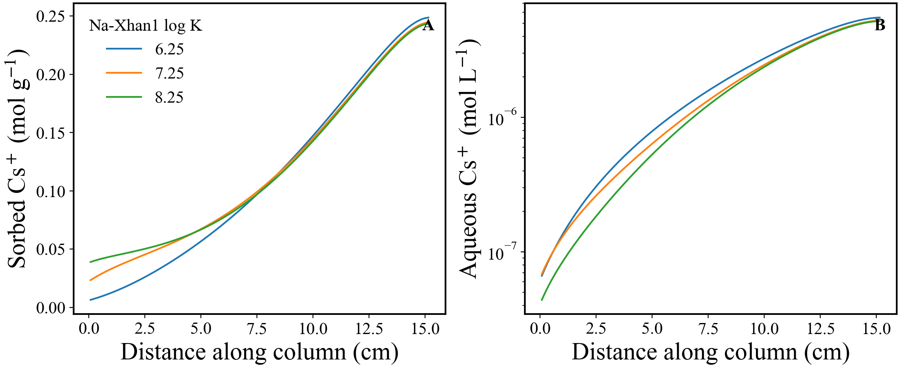

# Caesium ion exchange — sweeping a selectivity coefficient

**Capability shown:** sweeping a parameter in the *thermodynamic database*, which no keyword block
can reach.

The CrunchFlow short-course exercise fits caesium sorption on Hanford sediments with a three-site
ion-exchange model. Its selectivity coefficients live in `HanfordTanksColumnFit3Site-GT.dbs`, not in
the deck — they are exactly what PEST is pointed at in this community, and the reason
`database_parameters` exists.

## The sweep

```yaml
database_parameters:
  exchange:
    NaXhan1:
      log_k:
        - 'custom'
        - [6.25224, 7.25224, 8.25224]   # the fitted value, +/- 1 log unit
```

```bash
rhea cesium_exchange.yaml local --compile-inputs
```

Three runs, about three minutes. `ShortCourse12a.in` names the other two decks as
`later_inputfiles`, so each run is a chain of three and Omphalos stages one database for all three.

## What it produces

Each run's database differs from the template on **at most one line**, with the column alignment
intact. Run 1 differs on none: 7.25224 is the fitted value the sweep brackets, so its database is
byte-identical to the template.

```
run0: 'NaXhan1' 2  1.0 'Na+' 1.0 'Xhan1-'               6.25224  0.000
run1: 'NaXhan1' 2  1.0 'Na+' 1.0 'Xhan1-'               7.25224  0.000
run2: 'NaXhan1' 2  1.0 'Na+' 1.0 'Xhan1-'               8.25224  0.000
```

Everything else in those 3,691 lines — stoichiometry, the other fourteen exchange coefficients, the
mineral kinetics block — is byte for byte as it was.



The database writes log K for the *breakdown* of `NaXhan1`, so a larger value means sodium holds
site 1 less strongly and caesium competes better for it. Sorbed Cs rises with the coefficient and
aqueous Cs falls, and the curves separate at the inlet where the exchanger is still competing —
converging downstream where the sites saturate regardless.

## The thing to know

`conditions.nc` records what each run actually used, **read back out of the database it ran
against** rather than re-derived from the YAML. That is what makes a `random_uniform` sweep of a
database parameter recoverable afterwards, and it is why `--compile-inputs` is worth asking for as a
matter of habit.

Compare `quartz_pressure_series`, where the swept setting is one the database cannot record, and so
has to be written beside the run instead.

## Note on the decks

One change from the exercise: `graphics tecplot` instead of `kaleidagraph`, so Omphalos can collate
the output. With `kaleidagraph` the runs complete and nothing reaches `results.nc`. The change is
written into each deck as a comment, and the chemistry is untouched.

The same sweep run sequentially with `omphalos` reproduces these numbers to every digit, as does a
two-stage `restart_chain`.

## Files

| | |
|---|---|
| `cesium_exchange.yaml` | the sweep |
| `ShortCourse12a/b/c.in` | the exercise decks, copied |
| `HanfordTanksColumnFit3Site-GT.dbs` | the database being swept |
| `cesium_exchange.ipynb` | the analysis, with its outputs stored so it reads without running |
| `cesium_exchange.png` | the figure it produces |

Running the sweep adds `run0/ … run2/` — one database and one three-deck chain each — plus
`results.nc` and `conditions.nc`. Those are outputs, not inputs, and are not in the repository.
