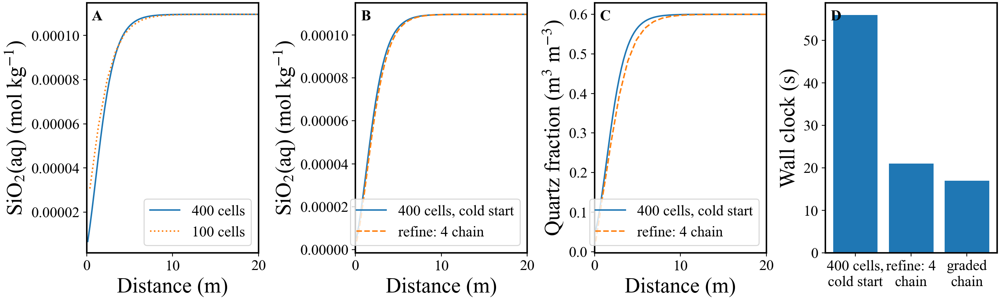

# CrunchTope + rhea worked example — changing grid resolution mid-run

A staged restart chain that **refines the grid between stages**: run coarse to near steady state,
transplant the whole geochemical state onto a finer grid through the restart file, and finish there.
The sweep example next door (`../quartz_flow_sweep/`) is the place to start for the general
workflow; this one is about the restart chain.

## Problem

The same quartz column as `../quartz_flow_sweep/`, with the rate constant and the Darcy flux each an
order of magnitude higher (`-rate -8.5`, `constant_flow 100.0`). The fluid reaches quartz saturation
within about 5 m of a 100 m column, so all the structure is at the inlet and a uniform grid spends
almost all its cells on saturated water that is not doing anything.

`timestep_max` is 0.5 yr rather than 5: at 100 m/yr the column flushes in 0.1 yr, so a 5 yr step
steps over the entire transient. That is also what makes these runs long enough for the cost of the
grid to be visible — 15 s at 100 cells against 54 s at 400.

Three ways to get a 400-cell answer at 5000 yr:

| config | what it does | wall clock |
|---|---|---|
| `quartz_fine_reference.yaml` | cold start, 400 cells throughout | 56 s |
| `quartz_refine_chain.yaml` | 100 cells to 4500 yr, then `refine: 4` for the last 500 yr | 21 s |
| `quartz_graded_chain.yaml` | 100 cells, then 100 cells concentrated at the inlet | 17 s |

## Contents

| File | What it is |
|------|-----------|
| `quartz_column.in` | CrunchTope template, discretised at the 100 cells stage 0 starts from |
| `quartz_column_fine.in` | The same deck at 400 cells, writing 4500 and 5000 yr so both stages can be compared at matched time |
| `datacom.dbs` | Thermodynamic database |
| `quartz_refine_chain.yaml` | Two-stage chain using the `refine: 4` shorthand |
| `quartz_graded_chain.yaml` | Two-stage chain refining only the first 20 m |
| `quartz_fine_reference.yaml` | Single cold-start run at 400 cells |
| `grid_refinement_chain.ipynb` | Compares the three and plots the outcome |
| `grid_refinement_chain.png` | The figure produced by the notebook |
| `*.nc` | Results, one per config (git-ignored; regenerable) |
| `run0/` | Per-run working directory written by `rhea` (git-ignored; regenerable) |

## Reproduce

```bash
cd omphalos/examples/grid_refinement_chain
conda activate omphalos

# Each writes results.nc; rename so the notebook can read all three.
rhea quartz_fine_reference.yaml local && mv results.nc quartz_fine_reference.nc
rhea quartz_refine_chain.yaml   local && mv results.nc quartz_refine_chain.nc
rhea quartz_graded_chain.yaml   local && mv results.nc quartz_graded_chain.nc

conda run -n JupyterEnv jupyter nbconvert --to notebook --execute --inplace grid_refinement_chain.ipynb
```

About 95 s in total for the three runs. Step 1 needs a working CrunchTope binary, configured in
`omphalos/settings.py`; step 2 needs only `xarray` and `matplotlib`.

## How the config works

```yaml
restart_chain:
    stages: 2
    spatial_profile:
        - [4500]      # stage 0 output times
        - [500]       # stage 1, appended: this output lands at 5000 yr
    grid:
        refine: 4     # stage 0 keeps the template's grid; stage 1 splits every cell into four
```

`refine: N` is shorthand. Written out, stage 1 is `xzones: [400, 0.25]`, and the two forms are
interchangeable. The shorthand also regenerates any spatial input file the deck reads — porosity,
temperature, tortuosity, permeability — at the new resolution, by replicating each value N times.
Without that a refined stage stops on a file of the wrong length:

```
Trying to read the file: temps.dat
Fortran runtime error: End of file
```

This deck reads no such files, so nothing is generated here; `../../../tests/unit/test_generate_inputs.py`
covers the case that does.

`grid` also takes explicit `xzones` per stage, which is how `quartz_graded_chain.yaml` refines only
the part of the column that needs it:

```yaml
    grid:
        - xzones: [100, 1.0]
        - xzones: [80, 0.25, 20, 4.0]     # 80 cells of 0.25 m, then 20 of 4 m
```

`xzones` takes (cell count, cell width) pairs, so that is the inlet resolution of the 400-cell run
for a quarter of the cells. Resampling maps by **position**, not by cell index, so the grading is
honoured.

## The result



Every comparison below is between two profiles at the **same simulated time**. That matters more
than it sounds: the reference writes an output at 4500 yr as well as 5000 precisely so the coarse
stage can be compared against it without folding 500 yr of quartz dissolution into what would look
like a resolution error.

| comparison | departure | what it measures |
|---|---|---|
| coarse vs cold start, both at 4500 yr | 15.7% | resolution alone |
| cold start, 4500 vs 5000 yr | 4.4% | elapsed time alone |
| refine chain vs cold start, both at 5000 yr | 3.7% | what the chain achieves |
| graded chain vs cold start, both at 5000 yr | 3.7% | as above, quarter the cells |

- **The chain gets the fine answer for a third of the cost.** The coarse grid it starts from is 15.7%
  off the fine answer at matched time (panel **A**); after 500 yr on the refined grid it is 3.7%
  (panel **B**), for 21 s against 56 s (panel **D**).
- **Watch the second row of that table.** 500 yr of dissolution moves the profile by 4.4% on its
  own, which is the same size as the chain's residual error. Compare the coarse stage at 4500 yr
  against the cold start at 5000 and you get 17.9%, all of it wrongly attributed to resolution.
- **The residual is in the mineral field, not the fluid.** At 100 m/yr the column flushes in 0.1 yr,
  so 500 yr on the fine grid relaxes the fluid completely — and the profiles still differ at the
  inlet. Quartz volume fraction in the first cell is 0.053 in the cold start against 0.026 in the
  chain (panel **C**), both at 5000 yr and both on 0.25 m cells. The coarse stage spent 4500 yr
  dissolving quartz through 1 m cells, which over-dissolves an inlet whose real gradient is much
  sharper, and the fine stage inherits that history. **Refining does not undo it.**
- **So the rule is: the coarse stage must be genuine spin-up for the slow variables too.** Here it
  is not, which makes this a more useful example than one where the numbers simply agreed. Refine
  earlier, or check the slow fields against a cold start before trusting a long coarse stage.

## What the results file looks like

A grid-varying chain reports every stage on one grid. Each stage's cells are placed at their nearest
position on the finest stage's grid, and cells no stage covers are left NaN — a scatter, so every
stored number is one the model produced and the coarse spin-up is still there to look at:

```
quartz_refine_chain      X = 400   times = [4500.0, 5000.0]   cells covered = [100, 400]
```

The graded chain keeps 200 positions instead, and says why:

```
Warning: stage grids do not nest, so two cells of one stage would land on the same cell of the
finest. Keeping the union of all stage positions instead, which loses nothing but leaves gaps in
every stage.
```

Its two grids are four times finer over the first 20 m and four times *coarser* over the remaining
80, so neither can hold the other's cells. The union is lossless where snapping would not be.

The InputFile returned in the pickle is the stage whose grid the results are on, so its `xzones`
and `INITIAL_CONDITIONS` regions agree with the `X` coordinate beside them.

## Things worth knowing before using this on your own model

- **`INITIAL_CONDITIONS` regions are rescaled for you.** A region written for 100 cells would
  otherwise abort a 400-cell stage with `You have specified a corner at JX > NX`.
- **`fix_porosity` is dropped** from a stage that names a porosity file. `StartTope.F90:2938-2950`
  reads `fix_porosity` first and jumps past `read_porosityfile` if it is set, so leaving both in
  place silently ignores the file.
- **A `.rst` overrides the deck.** `CALL restart` runs after `CALL StartTope`, so a porosity
  resampled from the coarse grid supersedes `read_PorosityFile` on the fine one. That is why a
  per-stage `porosity_file` is injected into the restart as well as written into the deck.
- **`timestep_max` in a restarted deck is ignored**; `restart.F90` takes `dtmax` from the restart
  file. Both stages here use the same value, so it does not bite.
- **`pump` coordinates in a `FLOW` block are not rescaled** — they name fixed cells, and moving them
  would be guesswork. A grid change warns about them.
