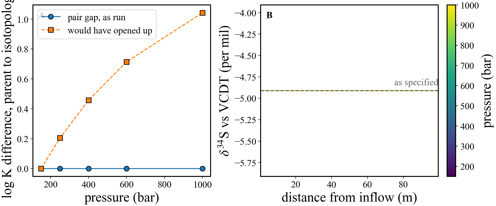

# An isotope system through a log K recomputation

**Capability shown:** `database_isotopes` and `database_logk` used together, which is the one
combination in this feature set that needs care.

A gypsum column at 25 °C carries sulfur as `SO4--` and `S34O4--`, taken from 150 to 1000 bar. Neither
the deck's database nor the shipped `datacom.dbs` contains any S34 — the whole system is built from
the config before each run — and the log K columns are then recomputed at each pressure.

## Why it needs care

`add_isotope` copies log Ks unchanged, deliberately, so that nothing it does imposes a fractionation:
an isotopologue and its parent are identical by construction. pyGCC holds no isotopologues — it can
compute `CaSO4(aq)` and has never heard of `CaS34O4(aq)` — so a recomputation moves one side of every
labelled pair and leaves the other, and the gap that opens up **is** an equilibrium fractionation the
database never had.

Omphalos records which rows carry identical log K columns before rewriting anything, rejoins any group
a recomputation splits, and says so once per run:

```
3 isotopologue row(s) copied back from the parent pyGCC recomputed and they cannot be,
so no fractionation is invented: ['secondary_species/CaS34O4(aq)',
'secondary_species/HS34O4-', 'secondary_species/NaS34O4-']
```

## What it produces

```bash
rhea isotope_pressure_series.yaml local --compile-inputs
```

Five runs, about a minute. Every pair is identical at every pressure, and δ³⁴S is flat:

| | |
|---|---|
| pair gap, parent to isotopologue | **0.0000** at all five pressures |
| δ³⁴S along the column | −4.911‰ vs VCDT, range 5 × 10⁻⁶‰ |
| δ³⁴S across the pressure series | spread 5 × 10⁻⁶‰ |
| what an unprotected recomputation would have added | ≈ **260‰** |

That last figure is the point. `CaSO4(aq)` moves 0.1006 log units between 150 and 1000 bar; a pair
separated by Δ log K fractionates by (10^Δ − 1) × 1000 ‰, so an unprotected recomputation would put
260‰ of invented fractionation into a system whose natural range is a few tens. On `SukindaCr53.dbs`
it is worse — `H2S(aq)` and `H2S34(aq)` separate by 0.33 log units at 500 bar, over 1000‰.



## Two things to know

**Declare your isotopes if you are going to recompute.** The pairing comes from what
`database_isotopes` recorded when it built the system. A database that merely *ships* with
isotopologues, recomputed with no `database_isotopes` block, is protected only where the names give
the pairing away — `H2S34(aq)` yes, `Gypsum34` no, since no rule recovers `Gypsum` from a name ending
in a lowercase letter and digits. That case is reported rather than repaired, as a `WARNING` naming
the rows.

**The deck has to link the pairs too**, with a line per pair in the `ISOTOPES` block — minerals
included:

```
ISOTOPES
primary  S34O4--   SO4--    0.0441626     ! rare, common, the VCDT 34S/32S ratio
mineral  Gypsum34  Gypsum   none
END
```

Leave the `mineral` line out and `Gypsum` and `Gypsum34` are independent phases, each driving its own
ion activity product to the same K; the fluid degenerates to ³⁴SO₄ = SO₄, about +21,600‰, whatever the
amounts present. It is a deck error that looks exactly like a thermodynamic one. `-associate` in the
`MINERALS` block is not the mechanism — that ties a rate law to another mineral's volume fraction.

## Files

| | |
|---|---|
| `gypsum_column.in` | the deck — no S34 in the database it reads, and no pressure anywhere |
| `isotope_pressure_series.yaml` | the isotope system and the pressure series |
| `datacom.dbs` | the template database, isotope-free |
| `isotope_pressure_series.ipynb` | the analysis, with its outputs stored so it reads without running |
| `isotope_pressure_series.png` | the figure it produces |

Running the sweep adds `run0/ … run4/`, `results.nc` and `conditions.nc`; those are outputs and are
not in the repository.

**A note on the pressures.** These five are ones this deck's inflow condition speciates at. It does
not at 1, 50, 100 or 900 bar, where CrunchTope's condition solver gives up on this fluid — chaotically
rather than systematically, the same behaviour `quartz_pressure_series` records for carbonate
conditions. It has nothing to do with the recomputation: the pair gaps were checked at all twelve
pressures tried, the four that fail included, and every pair came back identical. Change a pressure
here and you may need to pick another.
